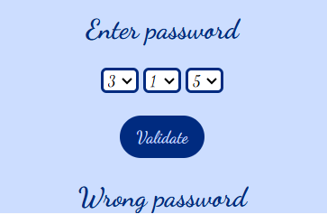

# JavaScript Exercises

This repository contains 3 JavaScript exercises.

## Exercise 1: Click to Add or Remove Border from an Image

In this exercise there is an image that adds or removes a border when clicked.

### Preview

## Exercise 2: Choose How Many Products You Want

This exercise involves creating an interface where users can select the number of products they want.

- If you select up to 10 products, a message will display the total number of products selected.
- If you select more than 10 products, a different message will appear.

### Preview

## Exercise 3: Enter Correct Passwords

This exercise requires the implementation of password validation. The two accepted passwords are "911" and "714".

- If you enter either of these passwords, a success message is shown.
- For any other input, an error message will be displayed.

### Preview

